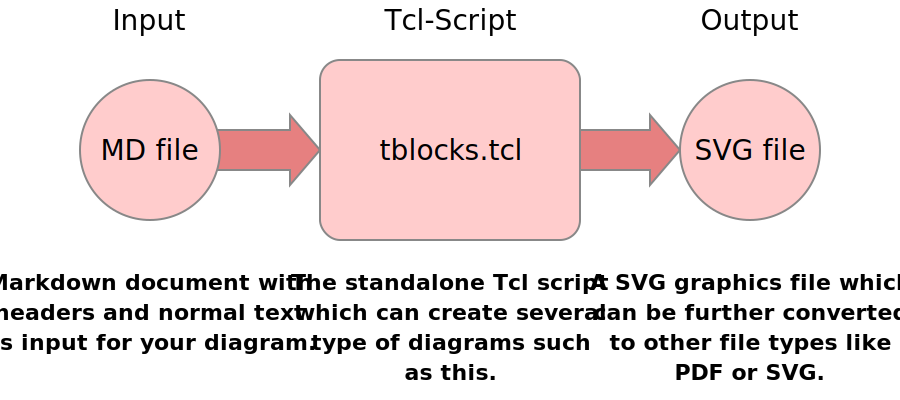
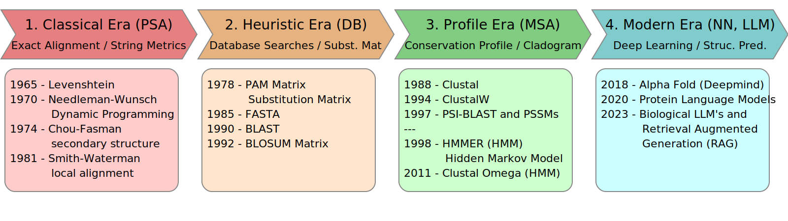
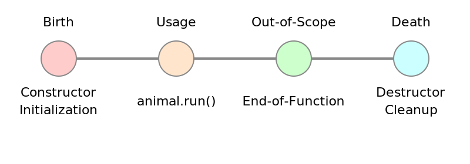
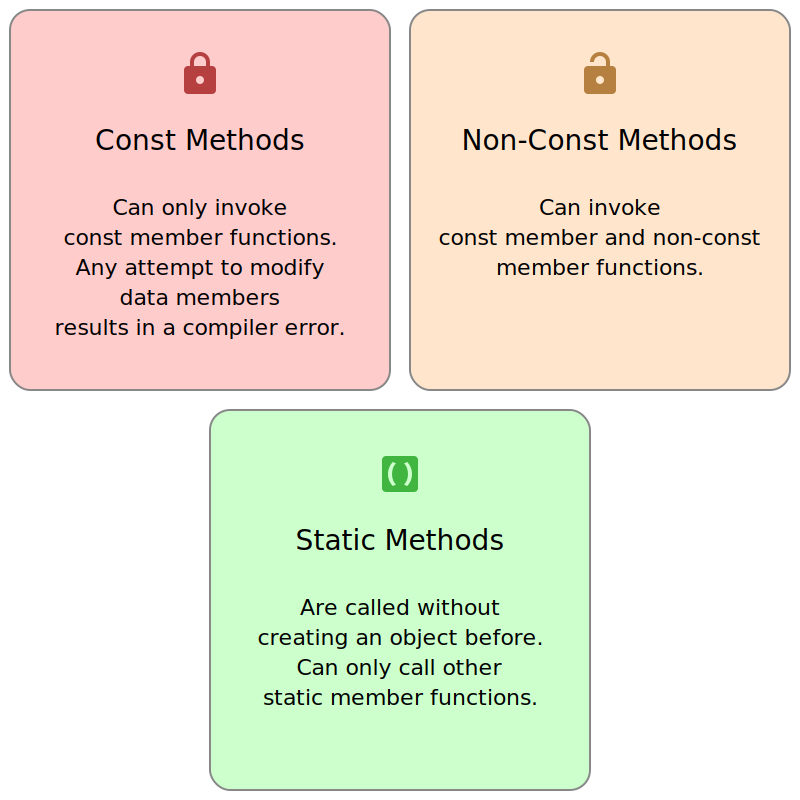
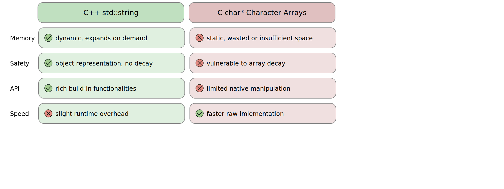
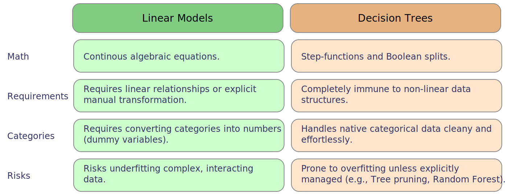
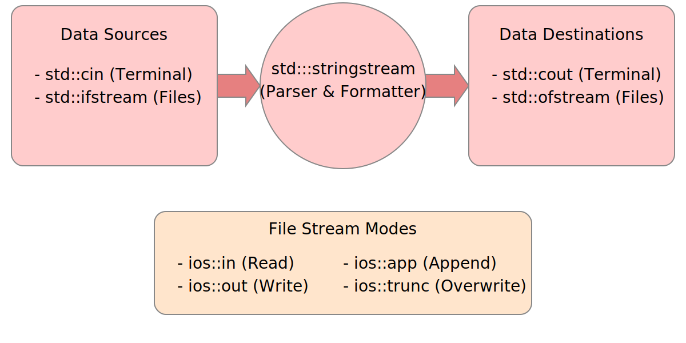
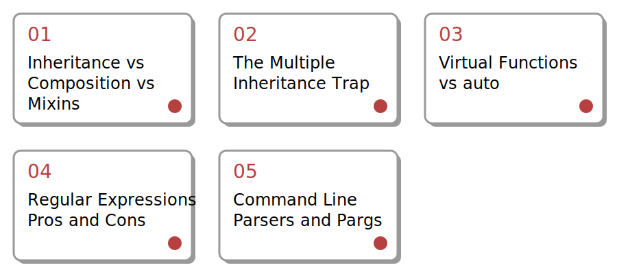
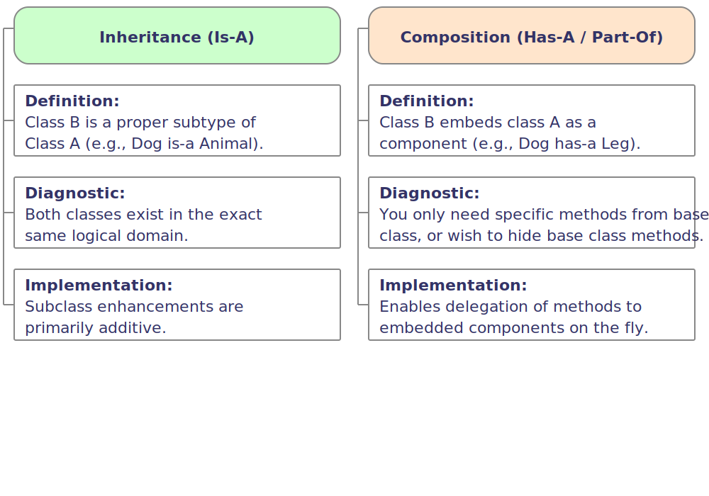
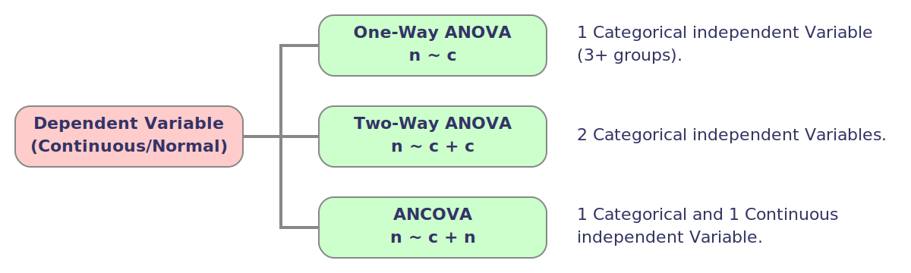

# tblocks

Tcl package to create diagrams with block elements.



This diagram was generated by tblocks.tcl with the Markdown code [here](https://raw.githubusercontent.com/mittelmark/tblocks/refs/heads/main/examples/tblocks.md). 
Why should we invent just another diagram language if we could just follow the
basic idea that we write our flowcharts simply in Markdown. Here an example:

```md
## Call by Value
Concept:
    Clones the data.

`int add(int x, int y);`
`add(x,y);`

Safe but inefficient for large
data structures.

## Pointers
Concept:
    Passes memory address.

`void swap(int *x, int *y);`
`swap(&x,&y);`

Requires eight '*' and two '&' symbols
for resolving the address issues.

## References
Concept:
    Creates an alias.

`void swap(int &x, int &y);`
`swap(x,y);`

Requires only 4 '&' and only in the
argument lists. Clean function call.
References can't be reassigned.
```

After we call our program like this: `tclsh tblocks.tcl --mode=blocks cpp-func.md cpp-func.svg`
we get the following output:


If you have four blocks, your tour blocks would be aligned as a 2x2 matrix. There are as well other type of block diagrams:

- tables - basically to big blocks side by side - see [examples/cpp-does.md](examples/cpp-does.md)
- sequences -  see [examples/sequence.md](examples/sequence.md)
- blocks - see [examples/cpp-overload.md](examples/cpp-overload.md)
- in-out sequences - see [examples/flow.md](examples/flow.md)

To generate images out of these files see the commands in the [Makefile](Makefile).

Here an example for a sequence:

```md
## Title 1

- point 1
- point 2
- point 3


## Title 2 icon:yes

- point 4
- point 5
- point 6

## Title 3

* point 7
* point 8
* point 9


## Title 4

* point 10
* point 11
* point 12
```

And here the output after a call like this `tclsh tblocks.tcl --mode=sequence sequence.md sequence.svg`.


Here an example of an input-output flow chart which can be processed with
`tclsh tblocks.tcl --mode=inout flow.md flow.svg`:

```md
## KNOWN

Input

This is some text which is
displayed over several 
lines in sequence.

## UNKOWN

Function


This function has to be found
by the algorithm.

## KNOWN

Output

This is the final output, we
optimize the function to find 
this.
```


If you need pdf or png files as output you might use a tool like cairosvg to
convert the svg files to these other image formats. :

## Fonts

The default fonts used by the application/package are Andika, a sans serif
font available from [https://www.fonts.bunny.net](https://www.fonts.bunny.net) and "Ubuntu
Mono" for monospaced text. Both fonts are dynamically loaded from that website. You can switch the fonts by providing the command line arguments `--sans-font="FONTNAME"`or `--mono-font="FONTNAME"` to change these two default fonts here an example,

Let's change the last image by using the "Alegreya Sans SC" font like so:

`tclsh tblocks/tblocks.tcl --mode=inout --sans-font="Alegreya Sans SC" flow.md flow-sc.svg`


> [!CAUTION]
> Please note that in some situations or for instance during conversion fo these fonts to PNG or PDF files suing 
> cairosvg or rsvg-convert the fonts must be as well installed locally to be embedded into the final output.


It is generally recommended to use sans serif fonts for the main text in
presentations as serif text is more suitable for longer text paragraphs. Bunny
Fonts is open source and non tracking so should be GDPR compliant. Here an example with a serif font which looks not clear enough for me.

`tclsh tblocks/tblocks.tcl --mode=inout --sans-font="Alegreya" flow.md flow-alegreya.svg`


## Colors

You can as well change the default color palette. You can do this, and as well
change the default fonts that way, within a header section at the beginning of
the file. Here an example where we create grey color diagram.

```md
---
sans-font: "Mali"
mono-font: "Chivo Mono"
color1: "#eeeeee" "#bbbbbb"
color2: "#eeeeee" "#bbbbbb"
color3: "#eeeeee" "#bbbbbb"
---
## Call by Value
Concept:
    Clones the data.

`int add(int x, int y);`
`add(x,y);`

...
```


## Diagram Types

Click on the images to see the source code:


[](https://raw.githubusercontent.com/mittelmark/tblocks/main/examples/timeline.md)
[](https://raw.githubusercontent.com/mittelmark/tblocks/main/examples/flow.md)

[](https://raw.githubusercontent.com/mittelmark/tblocks/main/examples/sequence.md)
[](https://raw.githubusercontent.com/mittelmark/tblocks/main/examples/cpp-func-colors.md)

[](https://raw.githubusercontent.com/mittelmark/tblocks/main/examples/linegraph.md)
[](https://raw.githubusercontent.com/mittelmark/tblocks/main/examples/iblocks.md)

[](https://raw.githubusercontent.com/mittelmark/tblocks/main/examples/itable.md)
[](https://raw.githubusercontent.com/mittelmark/tblocks/main/examples/itable2.md)

[](https://raw.githubusercontent.com/mittelmark/tblocks/main/examples/inout-block.md)

[](https://raw.githubusercontent.com/mittelmark/tblocks/main/examples/toc.md)
[](https://raw.githubusercontent.com/mittelmark/tblocks/main/examples/compare.md)

[](https://raw.githubusercontent.com/mittelmark/tblocks/main/examples/flow-lr.md)


## Embedding into LaTeX

You can as well embed tblocks into your LaTeX code by writing a macro like this:

```latex
\usepackage{xparse}
\usepackage{verbatim}
\NewDocumentEnvironment{tblocks}{m}
  {%
    \edef\mdfile{#1.md}%
    \edef\pdffile{#1.pdf}%
    \VerbatimOut{\mdfile}%
  }
  {%
    \endVerbatimOut
    \immediate\write18{tblocks "\mdfile" "\pdffile"}%
  } 
```

And within your LaTeX code you then can write tblocks Markdown code like so:

```latex
\begin{tblocks}{regexp}
## Classes

- basic_regex
- sub_match
- match_results

...
\end{tblocks}

\begin{center}
\hspace{-0.2cm}\includegraphics[width=14cm]{regexp}
\end{center}
```

Which then displays the generated PDF graphics within your LaTeX output file.
Please note that you must execute your LaTeX compiler with the --shell-escape
option to allow execution of embedded programming code.


## Documentation

[WIP Tutorial](http://htmlpreview.github.io/?https://github.com/mittelmark/tblocks/blob/master/tutorial/tutorial.html)

## Installation

Copy the [tblock.tcl](https://raw.githubusercontent.com/mittelmark/tblocks/main/tblocks/tblocks.tcl)
file to a belonging to your PATH and make it executable. You need to have the
Tcl programming language installed on your machine.

## TODO's

- font change via bunny.net (done)
- first level header sets the type or/and colors so '# mode:inout color1:#eeeeee #bbbbbbb' creates an inout diagram and sets color 1 to greyish (done)
- greyish backgrounds #eeeeee and #bbbbbb as defaut for all blocks 
- bluish backgrounds #eeeeff and #aaaaff for all blocks - etc
- list items starting with - are always left aligned
- flexible block height based on the number of input lines (partially done)
- 5 and 6 blocks for default blocks with 2/3 and 3/3 layout (done)
- more block types
- more icons (done via [https://github.com/Templarian/MaterialDesign](https://github.com/Templarian/MaterialDesign))
- tutorial documentation (started)

## Changes

- 2026-06-10 version 0.0.11 - adding flow-lr diagram
- 2026-06-29 version 0.0.10 - tweaking itable output to make it less wide, fixing missing command line message" 
- 2026-06-23 version 0.0.9 - adding compare diagram type, making itable more flexible with height determining and text wrapping
- 2026-06-21 version 0.0.8 - adding support for pdf conversion with cairosvg or rsvg-convert
- 2026-06-20 version 0.0.7 - adding 'toc' node
- 2026-06-19 version 0.0.6 - adding `--colorN="COLORS"` command line option
- 2026-06-17 version 0.0.5 - flexible size of iblocks height
- 2026-06-16 version 0.0.4 - adding inout-block and extending blocks to 5 blocks
- 2026-06-15 version 0.0.3 - adding iblocks and itable types with icon support from https://github.com/Templarian/MaterialDesign
- 2026-06-12 Version 0.0.2 - implemented blocks, inout, linegraph, sequence, timeline, table
- 2026-06-12 Version 0.0.1 - development started
- 2026-06-05 development started with version 0.0.1

## License

BSD-3-Clause

## Author and Copyright

Detlef Groth, University of Potsdam, Germany
